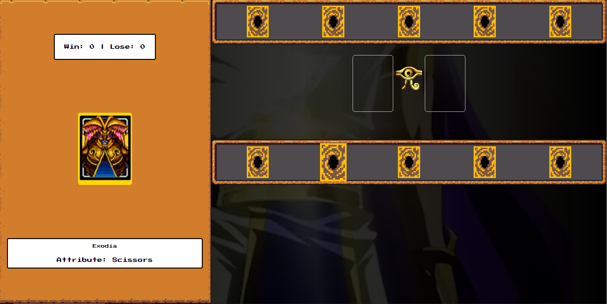
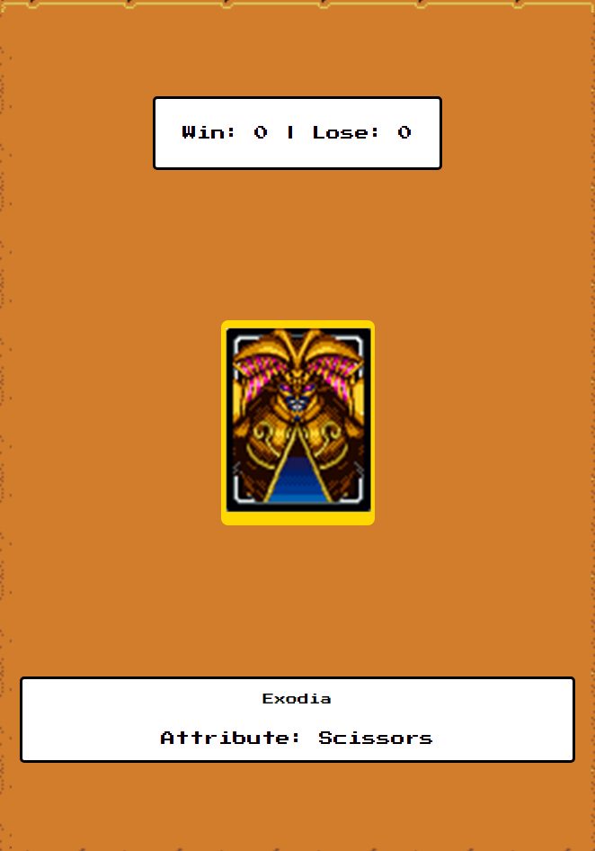

# Yu-gi-oh

Bem-vindo ao repositório do Jogo de Yu-gi-og! Este é um jogo simples onde você compete contra o computador em uma partida de "Pedra, Papel e Tesoura" com cartas.

## Descrição

Neste jogo, você e o computador recebem 5 cartas, cada uma representando "Pedra," "Papel," ou "Tesoura." Você escolhe uma das suas cartas, e o computador escolhe aleatoriamente uma das suas. O vencedor da rodada é determinado pelas regras do "Pedra, Papel e Tesoura." O objetivo é vencer o computador em uma série de rodadas e alcançar o placar mais alto.

## Como Jogar

1. Execute o jogo em sua máquina local (veja as instruções abaixo).
2. Você e o computador recebem 5 cartas, representando "Pedra," "Papel," ou "Tesoura."
3. Escolha uma das suas cartas para jogar.
4. O computador escolherá aleatoriamente uma carta.
5. O vencedor da rodada é determinado pelas regras do "Pedra, Papel e Tesoura."
6. O placar é atualizado após cada rodada.
7. Continue jogando para tentar vencer o computador.

## Instruções de Instalação e Uso

1. Clone ou baixe este repositório.
2. Execute o jogo em sua máquina local usando [instruções de execução, como comandos ou scripts].
3. Siga as instruções na interface de texto para jogar.

## Placar

O jogo acompanha o placar das rodadas, mostrando quantas vezes você venceu e quantas vezes o computador venceu. O objetivo é alcançar o placar mais alto e derrotar o computador!

## Contribuições

Contribuições para este projeto são bem-vindas

## Contato

Se você tiver alguma pergunta ou feedback, entre em contato comigo:

- [Victor Yazigi]
- [mambo0001@outlook.com]

## Status do Projeto

[Estável]

